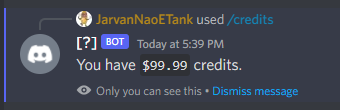
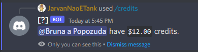
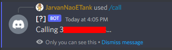
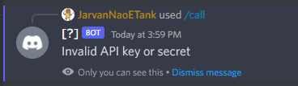

<p align="center">
  
</p>
                                                                        
<h1 align="center">AyxBot</h1>
<p align="center" style="color: #ccc;">
Discord bot that offers the functionality to call and send messages to phone numbers.
</p>

<center>


</center>

## Table of Content

- [Dependencies](#dependencies)
- [Commands](#commands)
- [Installation](#installation)
- [License](#license)

## Dependencies

=16.0.1-B?style=for-the-badge&logo=javascript&label=dotenv">
<br>
=5.0.8-B?style=for-the-badge&logo=sqlite&label=sqlite3">
<br>

<br>

<br>
=0.5.0-B?style=for-the-badge&logo=discord&label=@discordjs/rest">
<br>
=0.34.0-B?style=for-the-badge&logo=discord&label=discord-api-types">
<br>
=0.15.0-B?style=for-the-badge&logo=discord&label=@discordjs/builders">
<br>
=2.11.1-B?style=for-the-badge&logo=vonage&label=@vonage/server-sdk">

## Documentation

- **Discord.js** https://discord.js.org/#/
- **Vonage (Nexmo)** https://developer.vonage.com/api

## Commands

``/credits @user(optional)`` - See the credits of a user, or your credits.



``/call phone(required) message(required)`` - Calls to a phone number and say the message




## Installation

```bash
# Clone this repository
$ git clone https://github.com/thurdev/AyxBot

# Go into the repository
$ cd AyxBot

# Install dependencies
$ yarn install

# Don't forget to configure your .env file, just rename the .env.example to .env

# Run the app
$ yarn dev
```

## License

MIT


 <i style='text-align: center; color: red;font-size: 13px;'>CopyRight © ThurDev</i> 
